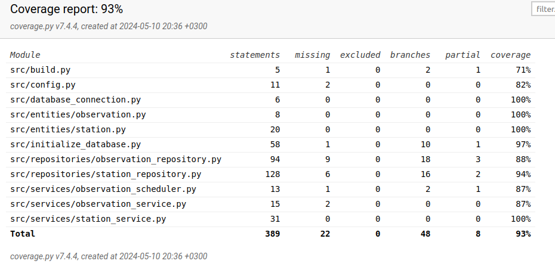

# Testing document

Application has been tested with `unittest` including automated unit and integration tests. System level tests have been made manually.

## Unit and integration testing 

### Application logic

The application logic in the following classes is tested as follows.

- `StationService` class tests are on [TestStationService`](https://github.com/mcpaulafi/ot-harjoitustyo/blob/main/src/tests/services/station_service_test.py)

`StationService` object is injected with `StationRepository` which database connection and results are simulated with MagicMock.

- `ObservationService` class tests are on [TestObservationService](https://github.com/mcpaulafi/ot-harjoitustyo/blob/main/src/tests/services/observation_service_test.py)

`ObservationService` object is installed so that it is injected with repository object `ObservationRepository` which database connection and results are simulated with MagicMock.

- `Scheduler` class tests are on [TestObservationScheduler](https://github.com/mcpaulafi/ot-harjoitustyo/blob/main/src/tests/services/observation_scheduler_test.py)

`Scheduler` object is installed so that it is injected with repository objects `ObservationService` and `StationService` whose database connections and results are simulated with MagicMock.

### Repository classes

- `StationRepository` class tests are on [TestStationRepository`](https://github.com/mcpaulafi/ot-harjoitustyo/blob/main/src/tests/services/station_repository_test.py)

`StationRepository` object has database connection and results simulated with MagicMock.

- `ObservationRepository` class tests are on [TestObservationRepository`](https://github.com/mcpaulafi/ot-harjoitustyo/blob/main/src/tests/services/station_observation_test.py)

`ObservationRepository` object has database connection and results simulated with MagicMock. It contains `FakeObs` class which simulates data results from FMI queries.

### Entity classes

- `Station` class methods are tested on [TestStation`](https://github.com/mcpaulafi/ot-harjoitustyo/blob/main/src/tests/services/station_test.py)

### Test coverage

Application test branch coverage is ?% excluding the layer of user interface.

Running build.py- ja initialize_database.py files from shell are tested manually.

## System tests

System test is done manually.

### Installing and configuration

Application has been downloaded and tested by following [the user manual](https://github.com/mcpaulafi/ot-harjoitustyo/blob/main/documentation/usermanual.md) in two different Linux environments. Tests did not check different configurations on  _.env_ file.

### Functionalities

All [specifications](https://github.com/mcpaulafi/ot-harjoitustyo/blob/main/documentation/specifications.md) and functionalities listed on the user manual have been checked. Also attempts have been made to fill input fields with false values such as empty ones.

## Remaining quality issues

There are no error messages in following cases:

- No read/write access to configuration files
- SQLite database has not been installed, `python -m poetry run invoke build` command is not run