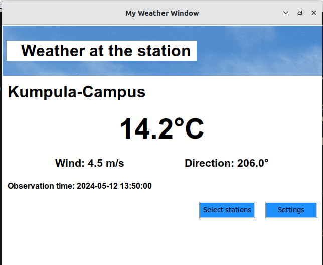

# User manual
## Configurating
Filenames that are used for saving data can be configured at start folder in .env file. Files are automatically created to the data folder if they do not exist. 
```
DATABASE_FILENAME=database.sqlite3
STATIONS_FILENAME=fmi_stations.csv
```
### Add or remove stations
Basic information of stations is copied to the CSV file in April 2024 from [FMI website](https://www.ilmatieteenlaitos.fi/havaintoasemat). If you want to add or remove stations, modify the rows in the file and run following commands to start the app again.


## Starting the app

Before starting the app, install dependencies with shell command:

```bash
poetry install
```

After that run setup with command:

```bash
poetry run invoke build
```

Now you can start the Weather Window app with command:

```
poetry run invoke start
```

## Using the app

### Select stations
Scroll the list of stations on the left to find a weather station. Click on it and "Add to >" button to move it to right to Selected stations list. You can add one by one at maximum 5 stations.

If you want to select a new set of stations, click on "< Clear all" button.

After selection click "Continue >" to proceed to Settings.


### Settings
On settings menu you can rename the selected stations if you like. You can use letters, numbers, space and dash (-) charactes in the names. You can also leave nickname fields empty.

Save your settings and continue to Weather View by clicking "Save and view >" button. Wait a bit, because it takes a few seconds while observation data is retrieved.


### Weather View

Application shows your selected stations in a loop. After 20 seconds the station is switched to next.

You can go back to Settings or to station selection from the buttons on the bottom right of the window.

Observation data from the stations is retrieved and updated approximately in every 10 minutes. 



### In case some observation data is missing

- Stations and/or connection to the station can be occassionally broken
- Not all stations measure wind and/or temperature, this app does not know which (yet)
- Stations usually send new data every 10 minutes
- App tries to get new data when observation time of a station is older than 10 minutes. If there is no new data, app will gradually slow down the frequency of queries up to 60 minutes
