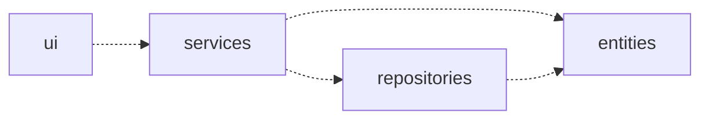
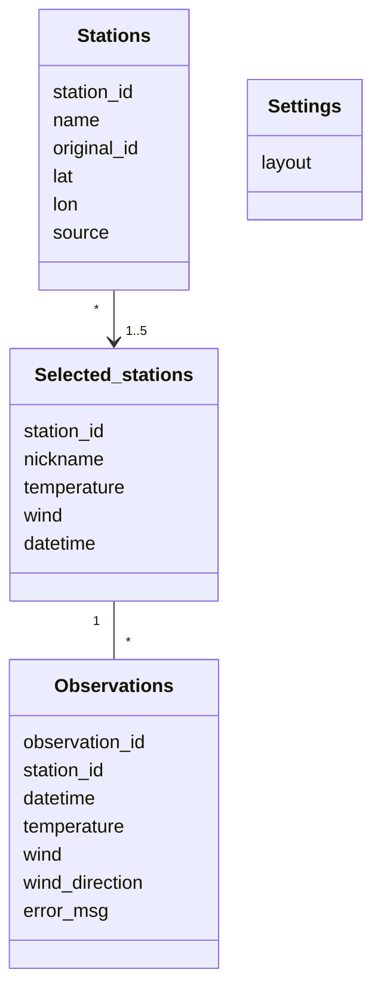
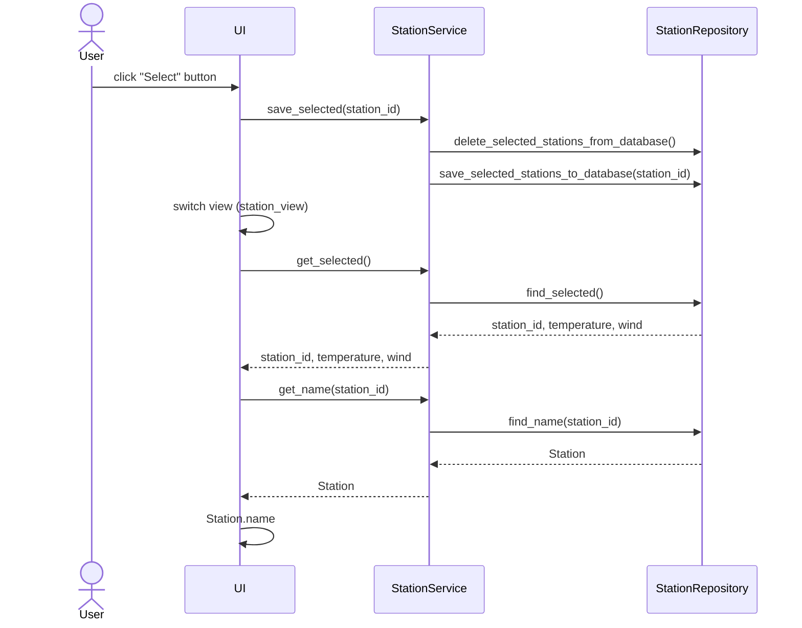
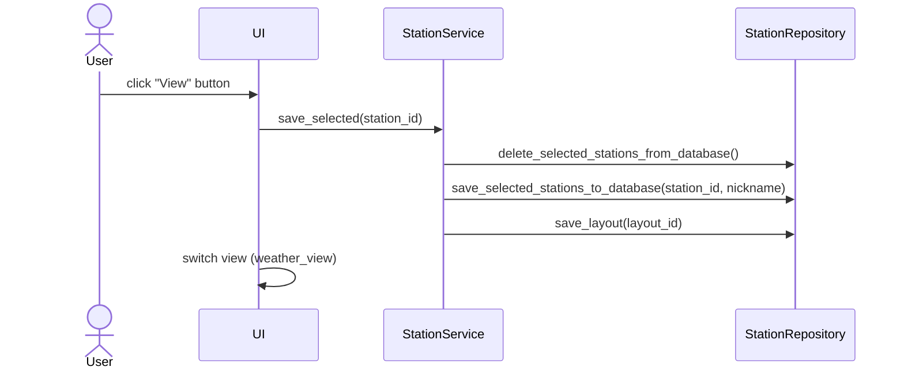
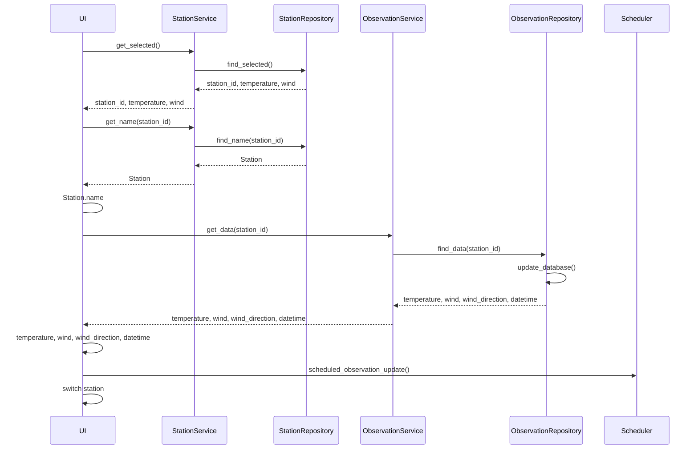
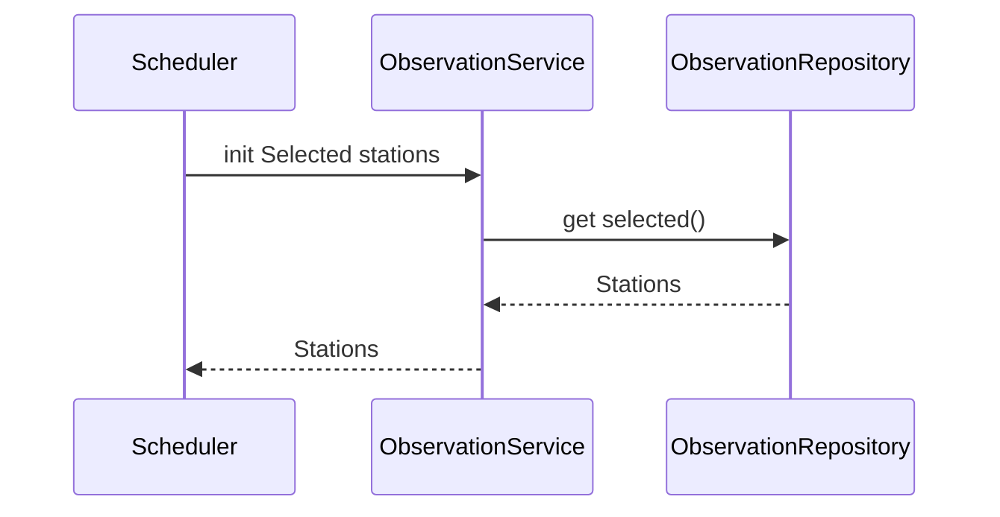

# Architecture
## Structure

Application has 3 level hierarchy, as follows



- **Ui**: user interphase
- **Services**: app logic
- **Repositories**: data storage
- **Entities**: class objects


## User interphase

User interphase contains 3 views:
- Select stations
- Settings
- Weather

Views are implemented as classes. Only one view is visible at the time to the user. Views are managed by UI class. User interphase is meant to be independent from the application logic and it utilizes methods from Service classes.

## Application logic

Data model of the application is constructed by classes Station and Observation which model weather stations and their observation data. 

[INSERT IMAGE]

Functions are in the Service classes StationService and ObservationService. 

**StationService** class provides following methods
- get_stations()
- get_station()
- save_selected()
- get_selected()

StationService has access to station data through StationRepository which is responsible of saving and retrieving data from the database.

Class and packing diagram for StationService and its dependencies to other application modules

[INSERT IMAGE HERE]

**ObservationService** class TBD.


## Data storage

Repository classes StationRepository and ObservationRepository are responsible for saving data to the database.

### Files

At the start the list of weather stations is uploaded to the database from a CSV file because they are not available from the open data of FMI.

Format in the file is following
```
"Ähtäri Inha",101520,62.55,24.14
"Alajärvi Möksy",101533,63.09,24.26
```

First on the row is the name of the station, then its id at FMI followed by latitude and longitude coordinates. Separation of the fields is made by comma character (,).

Stations are saved on SQLite database table called stations which is initialized on the file named initialize_database.py.

### Database

SQLite database tables are following 



## Main functions

Next the basic application logic is described on the sequence diagrams.

### Selecting stations
On Stationslist_view the user first selects a weather station from the listbox and then clicks the _Select_ button. Selection is saved on the database and view is switched to Station_view, which shows options for the selected station. 



### Settings for selected station

After the selection user can rename the station (give a nickname such as "Summer cabin"). TBD

After the selection user can also select which observation data (temperature, wind) is retrieved from the station. TBD

User can also select the layout for the weather view from some options. TBD




### Weather view

On station_view when user clicks the _Save and view_ button application swithes to weather_view and gets measurement data for the selected station(s). 




## Data update from FMI TBD
