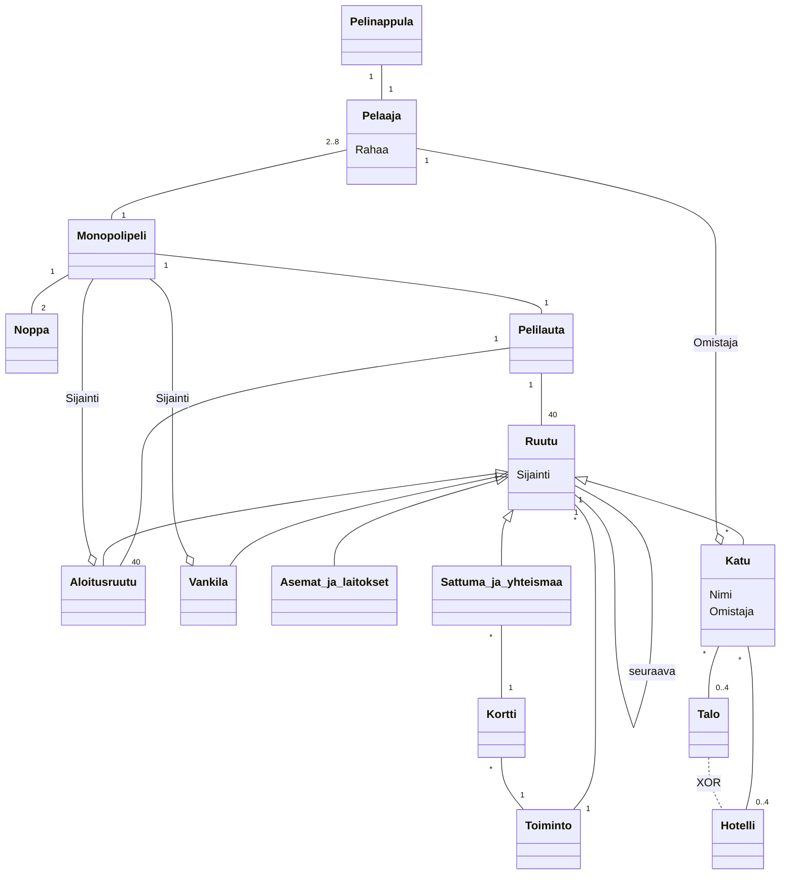

## Monopoli, alustava luokkakaavio

```mermaid
 classDiagram

    Monopolipeli "1" -- "2" Noppa
    Monopolipeli "1" -- "1" Pelilauta

    Pelilauta "1" -- "40" Aloitusruutu
    Pelilauta "1" -- "40" Ruutu

    Pelinappula "1" -- "1" Pelaaja
    Pelaaja "2..8" -- "1" Monopolipeli
    
    Ruutu "1" -- "1" Ruutu : seuraava
    Ruutu "*" -- "1" Toiminto

    Ruutu <|-- Aloitusruutu
    
    Ruutu <|-- Vankila

    Ruutu <|-- Asemat_ja_laitokset

    Ruutu <|-- Sattuma_ja_yhteismaa

    Ruutu <|-- Katu

    Monopolipeli --o Vankila: Sijainti
    Monopolipeli --o Aloitusruutu: Sijainti

    Kortti "*" -- "1" Toiminto

    Sattuma_ja_yhteismaa "*" -- "1" Kortti

    Katu "*" -- "0..4" Hotelli
    Katu "*" -- "0..4" Talo
    Talo .. Hotelli: XOR
    %% note "Neljän talon jälkeen hotelli"

    Pelaaja "1" --o "*" Katu: Omistaja

    class Ruutu {
        Sijainti
    }

    class Katu {
        Nimi
        Omistaja
    }

    class Pelaaja {
        Rahaa
    }


```
